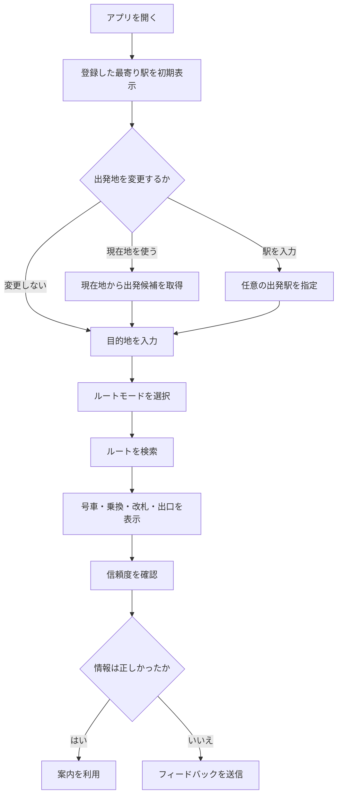

# 01 要件定義書

## 1. 文書目的

本書は、一般ユーザー向けの乗換え・駅構内ナビゲーションサービスについて、背景、目的、対象範囲、利用者ニーズ、機能要件および非機能要件を定義する。

本サービスは、従来の乗換案内が主に扱う「どの路線で、何時に、どの駅まで移動するか」だけでなく、利用者が実際に迷いやすい以下の導線まで案内する。

- どの号車・乗車位置を選ぶか
- 乗換駅でどの階段・エスカレーター・エレベーターへ進むか
- どの改札を利用するか
- どの出口から出るか
- 目的地へ最も近い出口はどこか

MVPでは「目的地の最寄り出口まで」を案内対象とし、将来的には「目的地の入口まで」を対象とする。

---

## 2. 背景と課題

発案者は名古屋から横浜へ転居後、関東圏の複雑な鉄道網や駅構内について、以下の不便を感じた。

- 乗換駅で進む方向が分からない
- 目的地に近い改札・出口が分からない
- 電車のどの号車に乗れば、乗換えや出口への移動が楽になるか分からない
- 大規模駅で階段や通路を間違え、余分に歩く
- 既存の乗換案内では、駅から駅までの移動は分かっても、駅構内の具体的な行動が分からない

この課題は特定の属性だけに限定されない。初めて利用する駅、複雑な駅、土地勘のない場所へ移動する利用者に共通する。

---

## 3. サービスコンセプト

> 乗る号車、乗換導線、改札、出口までを一続きで案内し、初めての駅でも迷わず移動できるナビゲーションサービス。

### 3.1 提供価値

| 従来の乗換案内 | 本サービス |
|---|---|
| 駅から駅までを案内 | 目的地最寄り出口まで案内 |
| 時刻・運賃が中心 | 迷わない移動導線が中心 |
| 乗換駅を提示 | 乗換駅での具体的な移動を提示 |
| 出口情報は補助的 | 改札・出口を主要情報として提示 |
| 文章や一覧が中心 | カードと簡易図で視覚的に提示 |

---

## 4. 対象ユーザー

属性ではなく、利用時の状態で定義する。

> 初めて行く場所、知らない駅、複雑な駅で迷いたくない人。

想定利用場面は以下とする。

- 転居後、周辺の鉄道に慣れていない
- 出張や旅行で初めて訪れる
- ライブ、イベント、商業施設へ向かう
- 病院、役所、学校などへ初めて行く
- 子ども連れ、ベビーカー、車いす、重い荷物がある
- 大規模駅や複雑な乗換えが苦手
- 最短時間よりも分かりやすさを重視したい

---

## 5. 対応プラットフォーム

最終的に以下を提供対象とする。

- Webアプリ
- PWA
- iOSアプリ
- Androidアプリ

各プラットフォームで、基本的な検索結果とアカウント情報を共有できることを前提とする。

---

## 6. 基本利用フロー



---

## 7. 入力要件

### 7.1 出発地

以下のいずれかを指定できること。

- 登録した最寄り駅
- 現在地
- 任意の駅名

初期値は、登録済みの場合は「登録した最寄り駅」を優先する。未登録の場合は、現在地または駅名入力を案内する。

### 7.2 目的地

以下を入力できること。

- 駅名
- 施設名
- 店舗名
- 住所

目的地が曖昧な場合は、候補を選択肢として提示する。

### 7.3 ルートモード

MVPでは以下の3モードを提供する。

| モード | 目的 |
|---|---|
| 最短 | 到着までの時間を優先する |
| 迷わない | 乗換え、改札、出口が分かりやすい導線を優先する |
| バリアフリー | 階段を避け、エレベーターまたはエスカレーターを優先する |

混雑回避モードはMVP対象外とする。

---

## 8. 機能要件

### 8.1 アカウント

- ユーザー登録
- ログイン・ログアウト
- 最寄り駅の登録
- よく使う駅の登録
- 検索履歴の保存
- お気に入りルートの保存
- Web・iOS・Android間での同期

初回利用時の離脱を抑えるため、検索前に登録必須とするか、初回検索後に登録を促すかはUX検証対象とする。正式方針としてはアカウントを前提とする。

### 8.2 ルート検索

- 出発地から目的地最寄り駅までの鉄道経路を取得
- ルートモードに応じて優先順位を変更
- 同等ルートが複数ある場合は歩行距離が短いものを優先
- 乗換回数、構内移動、階段利用などを評価
- 情報が不足する項目は推測せず「確認できません」と表示

### 8.3 駅構内案内

区間ごとに以下を表示する。

- 利用路線
- 行き先
- 乗車位置・推奨号車
- 推奨ドア位置
- 降車ホーム
- 乗換え方向
- 目指す階段・エスカレーター・エレベーター
- 改札名
- 出口番号・出口名
- 注意点

### 8.4 結果表示

結果画面は以下の順で構成する。

1. 最重要ポイント
2. ルートサマリー
3. ステップカード
4. 簡易レーン図
5. 区間ごとの詳細
6. 情報ごとの信頼度
7. フィードバック導線

### 8.5 AIチャット補助

基本操作はフォームとする。チャットは以下の補助用途に限定する。

- 曖昧な目的地の確認
- 「階段を使いたくない」などの自然文条件
- 表示結果に関する質問
- 代替ルートの相談
- 駅構内案内の補足説明

### 8.6 フィードバック

利用者は以下を報告できること。

- 号車が違う
- 改札が違う
- 出口が違う
- 階段・エスカレーター・エレベーター情報が違う
- 通路が工事中または通行できない
- より良いルートがある
- その他

必要に応じて、正しい情報や補足コメントも入力可能とする。

---

## 9. 信頼度表示

信頼度は「高・中・低」の3段階とし、全体を一括評価せず、情報単位で表示する。

| 対象 | 表示例 |
|---|---|
| 乗車位置 | 中 |
| 乗換導線 | 高 |
| 改札情報 | 高 |
| 出口情報 | 高 |
| バリアフリー情報 | 中 |

### 9.1 基本方針

- 高：公式情報または複数の信頼できる情報で確認済み
- 中：信頼できる情報はあるが、更新時期または詳細に不確実性がある
- 低：情報が限定的で、現地確認が必要
- 確認不能：推測せず「情報不足のため確認できません」と表示

---

## 10. UI/UX要件

### 10.1 基本原則

- 結論を最上部に表示する
- 画面を見た瞬間に、次の行動が分かる
- 長文を読まなくても移動できる
- 色だけに依存せず、文字・アイコン・形状を併用する
- 片手操作を想定する
- 駅構内での短時間確認を前提とする
- 画像生成を検索ごとに行わない
- HTML、CSS、SVG等で軽量な図解を描画する

### 10.2 表示例

```text
8号車付近に乗車
        ↓
渋谷駅でヒカリエ方面へ
        ↓
ヒカリエ改札
        ↓
B5出口
```

---

## 11. MVP範囲

### 11.1 MVPに含める

- 全国の駅を検索対象とする
- 出発地：登録最寄り駅、現在地、任意駅
- 目的地：駅、施設、店舗、住所
- 最短・迷わない・バリアフリーの3モード
- 推奨号車
- 乗換導線
- 改札
- 最寄り出口
- カードUI
- 軽量な簡易図
- 信頼度表示
- フィードバック
- Web/PWA
- アカウント・最寄り駅保存

### 11.2 MVPに含めない

- 目的地建物の正確な入口までの案内
- リアルタイム混雑回避
- 遅延連動
- 終電保証
- 詳細運賃計算
- 検索ごとの生成画像
- 完全な3D駅構内図
- 全駅での完全な号車・階段情報保証

---

## 12. 将来拡張

- 目的地入口までの徒歩案内
- 店舗・施設の入口選択
- リアルタイム工事・通行止め情報
- オフライン保存
- 音声案内
- 振動による進行通知
- 出発通知
- 乗換タイミング通知
- 駅構内の詳細図
- 利用者投稿の画像
- 多言語対応
- 駅員・鉄道事業者向け管理画面

---

## 13. 課金方針

### 13.1 初期

β期間は全機能を無料開放する。

### 13.2 正式提供後

推奨方式は検索回数ベースのフリーミアムとする。

| 無料 | 有料 |
|---|---|
| 月間の検索回数に上限 | 検索回数無制限 |
| 3モードすべて利用可能 | 3モードすべて利用可能 |
| 基本の履歴保存 | 長期間の履歴保存 |
| 基本のお気に入り | お気に入り上限拡張 |
| オンライン利用 | 将来のオフライン保存 |
| 標準サポート | 優先サポート |

バリアフリー機能はアクセシビリティ上重要なため、有料専用にはしない。

---

## 14. 成功指標

MVPでは以下を主要指標とする。

- 検索完了率
- 結果画面到達率
- 同一路線・同一目的地の再検索率
- 「案内どおりに移動できた」の回答率
- 誤情報報告率
- ルート保存率
- 7日・30日継続率
- 目的地到着後の満足度
- 有料化前の月間検索回数分布

---

## 15. 前提・制約

- 全国対応を掲げるが、駅ごとの情報密度には差がある
- 号車、階段、改札、出口は工事や運用変更の影響を受ける
- 不確実な情報は断定しない
- AIは情報の整理と説明に利用し、事実の生成元にはしない
- 利用者の現在地は必要な範囲でのみ利用する
- 時刻・運賃はMVPの主価値ではない
- UI/UXと情報の信頼性を、機能数より優先する
