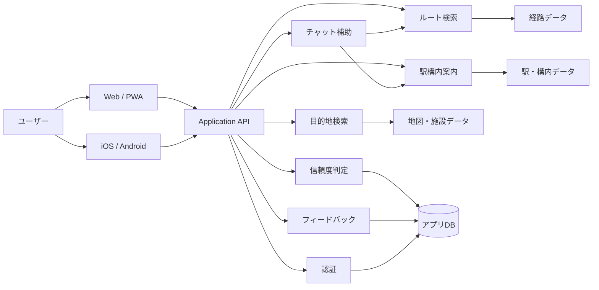
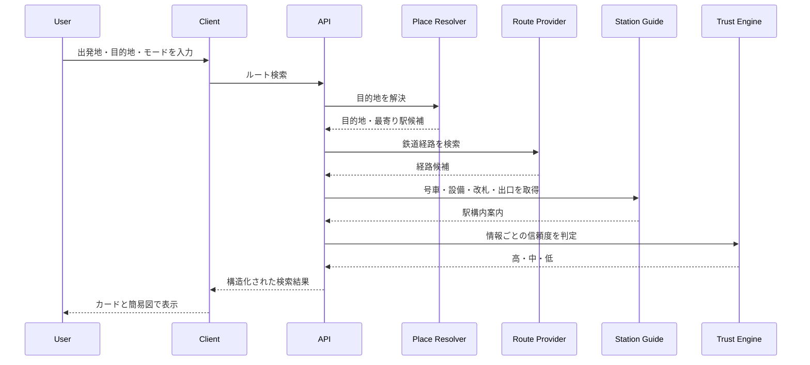
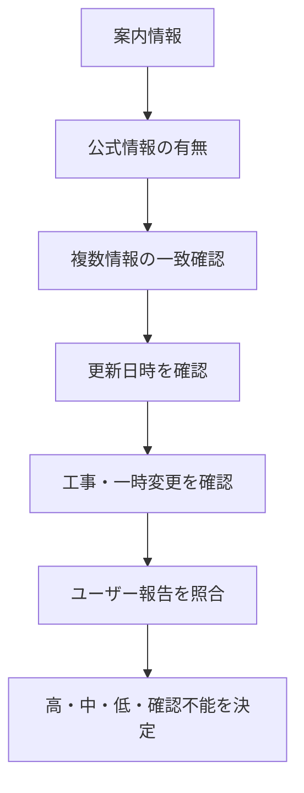
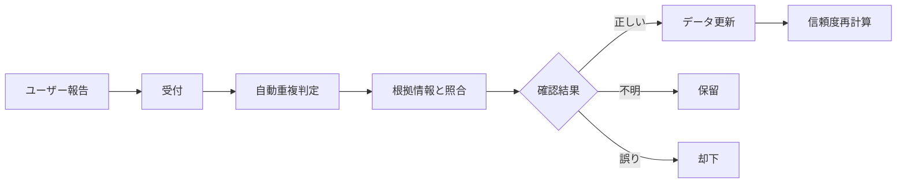

# 03 ストラクチャ構造

## 1. 文書目的

本書は、Web/PWA、iOS、Androidで共通利用する乗換え・駅構内ナビゲーションサービスの、システム構成、モジュール分割、データフロー、画面構造およびリポジトリ構成の基準を定義する。

特定フレームワークには固定せず、Webとモバイルでドメインロジックと型定義を共有できる構造を前提とする。

---

## 2. 全体構成



---

## 3. レイヤー構成

### 3.1 Presentation Layer

利用者との接点を担当する。

- Web UI
- PWA
- iOS UI
- Android UI
- フォーム検索
- カードUI
- 簡易レーン図
- チャットUI
- フィードバックUI
- 通知UI

### 3.2 Application Layer

ユースケースを担当する。

- ルート検索実行
- 目的地候補解決
- 最寄り駅・出口選定
- ルートモード適用
- 結果組み立て
- 信頼度付与
- お気に入り保存
- 履歴保存
- フィードバック受付
- 課金制御
- 通知登録

### 3.3 Domain Layer

サービス固有のルールを担当する。

- Route
- RouteSegment
- Station
- Platform
- BoardingPosition
- TransferGuide
- Gate
- Exit
- StationFacility
- Destination
- RouteMode
- Confidence
- Feedback
- SubscriptionPlan

### 3.4 Infrastructure Layer

外部サービス・永続化を担当する。

- 経路検索アダプター
- 駅データアダプター
- 地図・施設検索アダプター
- 認証アダプター
- データベース
- キャッシュ
- 通知配信
- 決済
- ログ・監視
- AIモデル接続

---

## 4. 推奨リポジトリ構造

```text
railway-navigation/
├─ apps/
│  ├─ web/
│  │  ├─ src/
│  │  │  ├─ app/
│  │  │  ├─ screens/
│  │  │  ├─ components/
│  │  │  ├─ features/
│  │  │  └─ adapters/
│  │  └─ public/
│  │
│  ├─ mobile/
│  │  ├─ src/
│  │  │  ├─ screens/
│  │  │  ├─ components/
│  │  │  ├─ features/
│  │  │  ├─ navigation/
│  │  │  └─ adapters/
│  │  └─ assets/
│  │
│  ├─ api/
│  │  ├─ src/
│  │  │  ├─ routes/
│  │  │  ├─ controllers/
│  │  │  ├─ usecases/
│  │  │  ├─ services/
│  │  │  ├─ repositories/
│  │  │  ├─ integrations/
│  │  │  └─ jobs/
│  │  └─ tests/
│  │
│  └─ admin/
│     ├─ src/
│     │  ├─ feedback/
│     │  ├─ station-data/
│     │  ├─ verification/
│     │  └─ users/
│     └─ tests/
│
├─ packages/
│  ├─ domain/
│  │  ├─ entities/
│  │  ├─ value-objects/
│  │  ├─ policies/
│  │  └─ errors/
│  │
│  ├─ application/
│  │  ├─ usecases/
│  │  ├─ ports/
│  │  └─ dto/
│  │
│  ├─ ui/
│  │  ├─ cards/
│  │  ├─ route-diagram/
│  │  ├─ icons/
│  │  ├─ forms/
│  │  └─ confidence/
│  │
│  ├─ schemas/
│  │  ├─ api/
│  │  ├─ route/
│  │  ├─ station/
│  │  └─ feedback/
│  │
│  ├─ config/
│  ├─ analytics/
│  └─ testing/
│
├─ data/
│  ├─ seeds/
│  ├─ fixtures/
│  ├─ station-aliases/
│  └─ migrations/
│
├─ docs/
│  ├─ 01_REQUIREMENTS.md
│  ├─ 02_SPECIFICATION.md
│  ├─ 03_STRUCTURE.md
│  ├─ api/
│  ├─ data-sources/
│  ├─ ux/
│  └─ operations/
│
├─ scripts/
│  ├─ import-stations/
│  ├─ verify-facilities/
│  ├─ recalculate-confidence/
│  └─ anonymize-data/
│
├─ tests/
│  ├─ e2e/
│  ├─ integration/
│  └─ contract/
│
└─ README.md
```

---

## 5. フロントエンド機能構造

### 5.1 web / mobile 共通機能

```text
features/
├─ auth/
├─ onboarding/
├─ search/
├─ destination/
├─ route-results/
├─ route-details/
├─ route-diagram/
├─ chat-assistant/
├─ confidence/
├─ favorites/
├─ history/
├─ feedback/
├─ subscription/
├─ location/
└─ notifications/
```

### 5.2 コンポーネント構造

```text
components/
├─ SearchForm
│  ├─ OriginField
│  ├─ CurrentLocationButton
│  ├─ DestinationField
│  ├─ RouteModeSelector
│  └─ SearchButton
│
├─ ResultSummary
│  ├─ KeyInstructionCard
│  ├─ RouteSummaryCard
│  └─ ConfidenceSummary
│
├─ RouteTimeline
│  ├─ StationStep
│  ├─ BoardingStep
│  ├─ TransferStep
│  ├─ GateStep
│  └─ ExitStep
│
├─ RouteDiagram
│  ├─ StationNode
│  ├─ LineConnector
│  ├─ FacilityIcon
│  ├─ DirectionArrow
│  └─ WarningBadge
│
└─ FeedbackForm
   ├─ TargetSelector
   ├─ CategorySelector
   ├─ CorrectionField
   └─ CommentField
```

---

## 6. API構造

### 6.1 エンドポイント例

```text
POST   /auth/register
POST   /auth/login
GET    /me
PATCH  /me/home-station

GET    /stations/search
GET    /places/search
POST   /routes/search
GET    /routes/{routeId}
POST   /routes/{routeId}/save

GET    /favorites
POST   /favorites
DELETE /favorites/{favoriteId}

GET    /history
DELETE /history/{historyId}

POST   /chat/messages

POST   /feedback
GET    /feedback/{feedbackId}

GET    /subscription
POST   /subscription/checkout
```

### 6.2 ルート検索リクエスト

```json
{
  "origin": {
    "type": "station",
    "stationId": "station_xxx"
  },
  "destination": {
    "type": "place",
    "placeId": "place_xxx"
  },
  "mode": "easy",
  "accessibility": {
    "avoidStairs": false,
    "preferElevator": false,
    "preferEscalator": false
  }
}
```

### 6.3 ルート検索レスポンス

```json
{
  "routeId": "route_xxx",
  "mode": "easy",
  "summary": {
    "originName": "西谷駅",
    "destinationName": "目的地",
    "arrivalStationName": "渋谷駅",
    "recommendedExit": "B5出口",
    "estimatedDurationMinutes": 42,
    "transferCount": 0
  },
  "keyInstruction": {
    "text": "8号車付近に乗り、ヒカリエ方面改札からB5出口へ進んでください。"
  },
  "segments": [],
  "confidence": {
    "boardingPosition": "medium",
    "transferGuide": "high",
    "gate": "high",
    "exit": "high"
  },
  "warnings": []
}
```

---

## 7. ルート検索ユースケース構造



---

## 8. ドメインモデル

### 8.1 Route

```text
Route
├─ origin
├─ destination
├─ mode
├─ segments[]
├─ estimatedDuration
├─ transferCount
├─ walkingDistance
├─ keyInstruction
├─ confidenceSummary
└─ warnings[]
```

### 8.2 RouteSegment

```text
RouteSegment
├─ type
│  ├─ train
│  ├─ transfer
│  ├─ station_walk
│  └─ exit
├─ from
├─ to
├─ line
├─ direction
├─ platform
├─ boardingPosition
├─ facilities[]
├─ instruction
├─ confidence
└─ sourceReferences[]
```

### 8.3 Confidence

```text
Confidence
├─ level
│  ├─ high
│  ├─ medium
│  ├─ low
│  └─ unavailable
├─ reasons[]
├─ verifiedAt
├─ expiresAt
└─ sourceCount
```

---

## 9. 情報取得アダプター構造

外部データソースをアプリ本体へ直接結合しない。

```text
integrations/
├─ route-provider/
│  ├─ RouteProviderPort
│  ├─ ProviderAAdapter
│  └─ ProviderBAdapter
│
├─ station-provider/
│  ├─ StationProviderPort
│  ├─ OfficialStationAdapter
│  └─ InternalStationRepository
│
├─ place-provider/
│  ├─ PlaceProviderPort
│  └─ MapPlaceAdapter
│
├─ ai-provider/
│  ├─ AiProviderPort
│  └─ AiAdapter
│
└─ notification-provider/
   ├─ NotificationProviderPort
   └─ PushNotificationAdapter
```

目的は、データ提供元の変更、障害、契約変更に対応しやすくすること。

---

## 10. 信頼度エンジン構造

```text
trust/
├─ ConfidenceCalculator
├─ SourcePriorityPolicy
├─ FreshnessPolicy
├─ SourceAgreementPolicy
├─ UserFeedbackPolicy
├─ ConstructionImpactPolicy
└─ FormationDifferencePolicy
```

### 判定フロー



---

## 11. 図解レンダリング構造

図解はAI画像生成ではなく、構造化データから描画する。

```text
route-diagram/
├─ RouteDiagramRenderer
├─ LayoutCalculator
├─ NodeFactory
├─ ConnectorFactory
├─ FacilityIconMap
├─ ConfidenceBadgeMap
└─ ResponsiveLayoutPolicy
```

### 入力

- 駅
- 区間
- 推奨号車
- 設備
- 改札
- 出口
- 注意情報

### 出力

- Web向けSVGまたはDOM
- モバイル向けネイティブ描画
- スクリーンリーダー用代替テキスト

---

## 12. フィードバック運用構造



### 管理画面機能

- 未確認フィードバック一覧
- 対象駅・対象ルート絞り込み
- 公式情報との比較
- 採用・却下
- 有効期限設定
- 変更履歴
- 信頼度再計算

---

## 13. キャッシュ構造

```text
cache/
├─ station-master-cache
├─ place-search-cache
├─ route-search-cache
├─ station-guide-cache
└─ confidence-cache
```

### 方針

- 駅マスタは比較的長く保持
- 検索結果は条件単位で保持
- 工事や一時変更情報は短く保持
- 信頼度の低い情報は長期キャッシュしない
- キャッシュ表示時は取得日時を表示可能にする

---

## 14. テスト構造

### 14.1 Unit Test

- ルートモードの評価
- 信頼度判定
- 目的地候補の順位付け
- 出口候補の順位付け
- バリアフリー条件
- 課金回数判定

### 14.2 Integration Test

- 経路データとの連携
- 駅構内データとの連携
- 地図・施設検索との連携
- 認証
- 決済
- 通知

### 14.3 Contract Test

- 外部データソースのレスポンス変更検知
- APIスキーマ整合性
- Web・モバイル間の型整合性

### 14.4 E2E Test

代表的なケース：

- 乗換えなしで目的地最寄り出口まで案内
- 1回乗換えで同一ホーム
- 大規模駅で複数改札
- バリアフリー経路
- 号車情報不足
- 出口工事中
- 現在地取得拒否
- 同名施設の候補選択
- フィードバック送信
- 無料回数上限到達

---

## 15. 開発フェーズ構造

### Phase 1：基礎検証

- フォーム検索
- 出発駅・目的地
- 3モード
- ルート結果カード
- 信頼度表示
- 限定的な駅構内情報
- Web/PWA

### Phase 2：MVP

- 全国検索
- アカウント
- 最寄り駅保存
- お気に入り・履歴
- 簡易図
- フィードバック
- 管理画面
- iOS/Android

### Phase 3：正式版

- フリーミアム
- 通知
- データ更新運用
- 複数データソース
- 保存ルート更新
- 分析・改善

### Phase 4：拡張

- 目的地入口
- オフライン
- 多言語
- 音声案内
- リアルタイム工事情報
- 鉄道事業者連携

---

## 16. 重要な設計原則

1. AIを事実の唯一の生成元にしない
2. 不明な情報を推測で補完しない
3. 外部データソースをアダプターで分離する
4. Webとモバイルでドメインモデルを共有する
5. 画像生成ではなく軽量な構造化図解を採用する
6. 信頼度は情報単位で管理する
7. バリアフリー機能を有料専用にしない
8. フィードバックをデータ改善の中心に置く
9. 全国対応と完全対応を混同しない
10. 機能数より、迷わず使える体験を優先する
